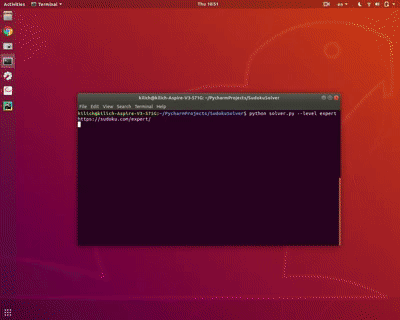

# Sudoku-Solver

A Python script which solves a Sudoku with Constraint Propagation technique and Search on [sudoku.com](https://sudoku.com/).  <br />
[Udacity AI nanodegree]

## Usage

Run the following command on your Linux terminal.

```bash
python solver.py [--level easy/medium/hard/expert]
```
